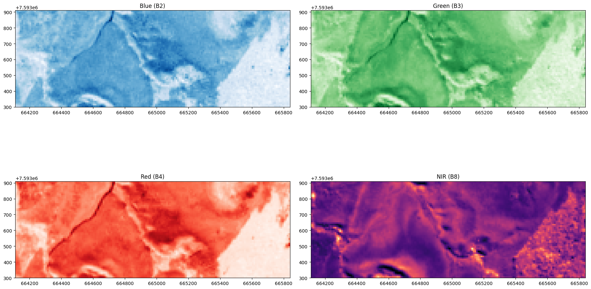

# Introdução ao Google Earth Engine

## Sensoriamento remoto via satélite

Atualmente, há cerca de 5.000 satélites ativos orbitando a Terra. Este
número inclui satélites de comunicação, meteorológicos, de observação da
Terra, científicos, militares, entre outros.

O número de sensores por satélite varia conforme o propósito do
satélite. Satélites de observação da Terra, como os da série Landsat,
Sentinel e outros, geralmente possuem entre 1 a 10 sensores, dependendo
da sua missão específica.

O **Landsat 8** possui dois sensores principais: **OLI** (Operational
Land Imager) e **TIRS** (Thermal Infrared Sensor). Enquanto cada
satélite da série **Sentinel-2** possui um sensor **MSI** (MultiSpectral
Instrument).

A quantidade de imagens geradas por mês também varia conforme a
capacidade dos satélites e a demanda por dados. Para satélites de
observação da Terra, pode-se estimar que cada satélite pode gerar entre
algumas centenas a milhares de imagens por mês.

Cada satélite **Sentinel-2** pode gerar cerca de 100 terabytes de dados
por mês, com imagens cobrindo grandes áreas da superfície terrestre. O
programa **Landsat** produz centenas de imagens diariamente, acumulando
milhares de imagens por mês.

O **Sentinel-2** é uma parte crucial do projeto **Copernicus**, uma
iniciativa conjunta da Comissão Europeia e da Agência Espacial Europeia
(ESA) para observar a Terra. **Sentinel-2** consiste em um conjunto de
dois satélites: **Sentinel-2A** e **Sentinel-2B**, lançados em 2015 e
2017, respectivamente.

**Principais Características**

-   **Objetivo**: Fornecer imagens multiespectrais de alta resolução
    para monitoramento ambiental, agricultura, florestas, gestão de
    desastres, cartografia e segurança.
-   **Sensores**: Cada satélite possui um sensor MSI (MultiSpectral
    Instrument) que captura imagens em 13 bandas espectrais, variando do
    visível ao infravermelho próximo e de ondas curtas.
-   **Resolução Espacial**: Oferece resoluções de 10, 20 e 60 metros,
    dependendo da banda espectral.
-   **Cobertura**: Tem uma ampla faixa de varredura de 290 km,
    permitindo uma cobertura rápida e frequente da superfície terrestre,
    revisitando a mesma área a cada 5 dias.
-   **Dados**: Os dados são gratuitos e abertos ao público, promovendo a
    sua ampla utilização em diversas aplicações científicas, comerciais
    e ambientais.

**Aplicações**

-   **Agricultura**: Monitoramento do crescimento das culturas, saúde
    das plantas e planejamento agrícola.
-   **Florestas**: Mapeamento e monitoramento das florestas, detecção de
    desmatamento e análise de mudanças na cobertura florestal.
-   **Água e Costas**: Monitoramento de corpos d\'água, qualidade da
    água e áreas costeiras.
-   **Desastres Naturais**: Apoio na gestão e resposta a desastres
    naturais como inundações, incêndios florestais e deslizamentos de
    terra.
-   **Uso do Solo e Urbanização**: Análise e mapeamento do uso do solo,
    expansão urbana e planejamento territorial.

O **Sentinel-2**, com seus dados de alta qualidade e acessibilidade, é
uma ferramenta essencial para a gestão sustentável dos recursos naturais
e para enfrentar desafios ambientais globais.

## Google Earth Engine

**Google Earth Engine** é um catálogo que contém mais de 80 *petabytes*
de dados geospaciais, disponíveis para análise e visualização, desde que
o usuário cadastre uma **api key**, e que as regras de termos de uso do produto sejam respeitadas.

Conta também com um editor de código
(<https://code.earthengine.google.com/>), útil para extrair as
coordenadas da área de interesse, caso o usuário prefira outro ambiente de
desenvolvimento.

## Procedimentos básicos

### Importamos as bibliotecas

``` python
import ee
import geemap
import rasterio
from rasterio.plot import show
import matplotlib.pyplot as plt
from matplotlib.patches import Polygon
```

### Inicializamos a API

``` python
# Processo de autenticação
ee.Authenticate()

# Inicializamos a biblioteca
ee.Initialize()
```

### Intervalo temporal

Definimos o período para captura das imagens:

``` python
data_inicial = '2024-04-01'
data_final = '2024-07-31'
```


### Área de interesse

Definimos as coordenadas da área de interesse:

``` python
polygon_coords = [
    [-43.41287287680422, -21.756108688468274],
    [-43.396307553928246, -21.756108688468274],
    [-43.396307553928246, -21.750887131860495],
    [-43.41287287680422, -21.750887131860495],
    [-43.41287287680422, -21.756108688468274]
]

aoi = ee.Geometry.Polygon(polygon_coords, None, False)
```


### Definimos a coleção de imagens

Aplicamos os seguintes filtros:

-   área de interesse;
-   intervalo temporal;
-   seleção de bandas

``` python
sel_bandas = ('B2', 'B3', 'B4', 'B5', 'B8')

db = ee.ImageCollection('COPERNICUS/S2_SR_HARMONIZED') \
                .filterBounds(aoi) \
                .filterDate(ee.Date(data_inicial), ee.Date(data_final)) \
                .select(sel_bandas)
```


### Extraímos a imagem com menor cobertura de nuvens

``` python
img = ee.Image(db.sort('CLOUDY_PIXEL_PERCENTAGE').first())
```


### Salvamos a imagem no formato tif

``` python
filename = 'teste.tif'
geemap.ee_export_image(img, filename=filename, scale=10, region=aoi, file_per_band=False)
    
```


    Generating URL ...
    Downloading data from https://earthengine.googleapis.com/v1/projects/earthengine-legacy/thumbnails/19173b9b5d62449fae0e3e3917e4cb32-a66a6b3909912300c02b12e1d56ca593:getPixels
    Please wait ...
    Data downloaded to /home/gf/jupyterlab_projects/Sat_Images/teste.tif

### Abrimos o arquivo TIFF

``` python
with rasterio.open('teste.tif') as dataset:
    multibanda = dataset.read()
```


### Selecionamos uma banda específica

``` python
with rasterio.open('teste.tif') as dataset:
    band3 = dataset.read(3)
```


### Visualizamos a imagem com Matplotlib

``` python

plt.imshow(band3, cmap='pink')
plt.show()
```


### Alteramos o formato da imagem e o mapa de cores

``` python
with rasterio.open('teste.tif') as src:
    imagem = src.read(3)
    metados = src.meta

# Plotar a imagem e o polígono usando matplotlib e rasterio
fig, ax = plt.subplots(figsize=(10, 10))
show(imagem, transform=src.transform, cmap='RdYlGn', ax=ax, interpolation='none')

# Configurar o título e exibir o plot
ax.set_title('Imagem com polígono de interesse')
plt.xlabel('Longitude')
plt.ylabel('Latitude')
plt.show()
```


### Visualizamos múltiplas bandas separadamente com rasterio.plot

``` python
# Abrir o arquivo raster
with rasterio.open('teste.tif', 'r') as raster:
    # Criar a figura com 2 colunas e 2 linhas para 4 gráficos
    fig, axs = plt.subplots(ncols=2, nrows=2, figsize=(18, 12))

    # Plotar as bandas
    show((raster, 1), cmap='Blues', ax=axs[0, 0])  # Banda B2 (Azul)
    show((raster, 2), cmap='Greens', ax=axs[0, 1])  # Banda B3 (Verde)
    show((raster, 3), cmap='Reds', ax=axs[1, 0])    # Banda B4 (Vermelho)
    show((raster, 4), cmap='magma', ax=axs[1, 1])   # Banda B8 (NIR)

    # Adicionar títulos aos gráficos
    axs[0, 0].set_title("Blue (B2)")
    axs[0, 1].set_title("Green (B3)")
    axs[1, 0].set_title("Red (B4)")
    axs[1, 1].set_title("NIR (B8)")

    fig.tight_layout()

    # Mostrar os gráficos
    plt.show()
```



